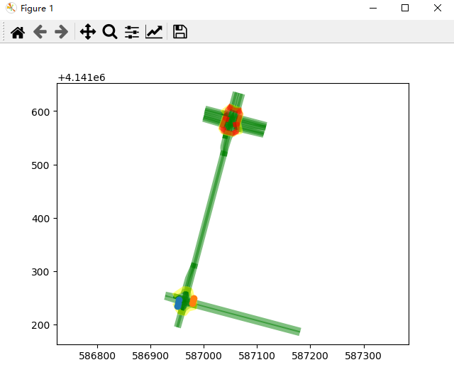

## map_label_tool
The map label tool is used to label and display the map.
```
map.py  // hd-map struct
draw.py  // draw the map
```

## quick start
Install conda first, then install protobuf, use `conda install protobuf` to install will fail, I haven't found the reason yet.
```
pip install protobuf
```

run the command below.
```
python main.py
```

## example
The following is the display of the hdmap in `data\borregas_ave.txt`.
  
