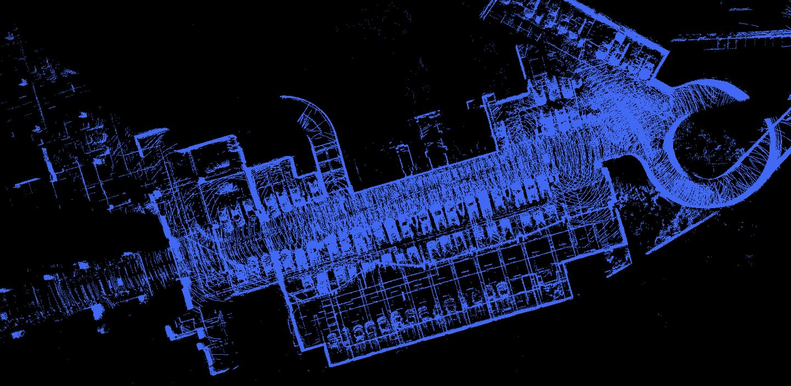

## Quick Start
This is Baidu apollo offline mapping tool, you can follow below steps to start to build the map.  
1. Copy the whole dir `ndt_mapping` to apollo's `modules/localization/msf/local_tool/`
2. Build the localization module `./apollo.sh build localization`
3. Run the cmd to build map `./bazel-bin/modules/localization/msf/local_tool/ndt_mapping`

## Example
The following is the result of the mapping of the underground parking lot.
  

